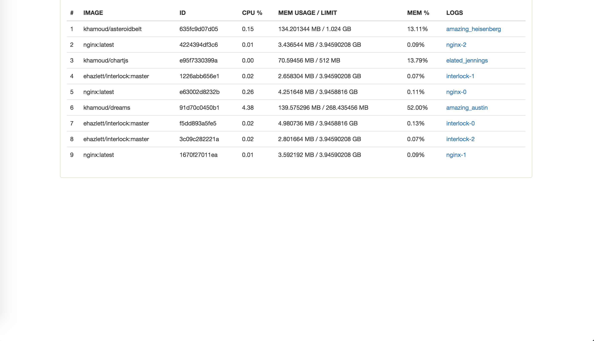
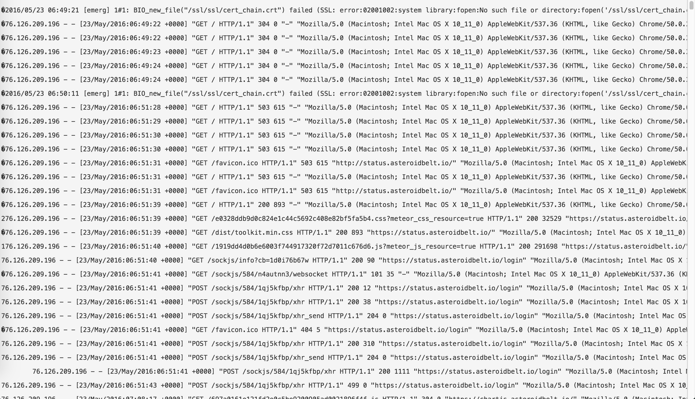

# dreams

Streams information about your docker swarm to your browser.  To run just use:

```
docker run -d \
    -e ROOT_URL=http://some_url \
    -v /path/to/your/keys:/certs:ro \
    -e METEOR_SETTINGS='{"DOCKER_HOST":"1.2.3.4","CERT_FILE_PATH":"/certs"}' \
    -p 80 \
    khamoud/dreams
```

*It needs the ROOT_URL because it is a meteor app and is required to run*

### Dashboard


### Logs


